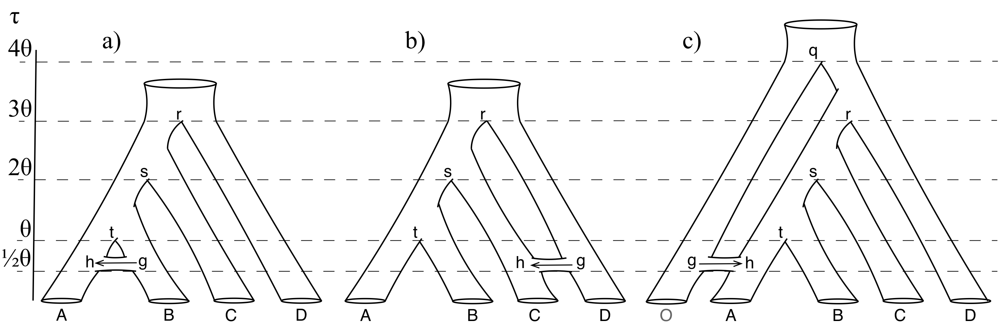

# bpp_simulationTools
## Scripts for automating simulation experiments in BPP to evaluate divergence time estimation in the presense of gene flow
Three scenarios are tested here
1. Post-divergence gene-flow between sister species (a)
2. Gene flow between non-sister species (b)
3. Gene flow from an unsampled ghost lineage into an extant species (c)
  


Scripts for simulation and estimation under the MSci model for the three trees are in the folders msci1, msci2, and msci3. There is also simulation under the IM model, but estimation with MSci in im1, im2, and im3.

```simDriver.pl``` does the work, but depends on the control files as templates for simulation and estimation.
